As a part of bigger project I needed to implement solution that would detect user presence within apartment and allow those users to control IOT aplliances set in that home area. Of course, accurate  user presence detection is the main obstacle here as we want to be sure that every user interaction with IOT devices happens only if user is physically present. But how we can do that? 

## Answer is beacons 
Beacons are small battery powered Bluetooth Low Energy transmitters that broadcast a unique identifier that can be intercepted by any device (smartphone for example) that have Bluetooth LE embedded antenna in it. Low power consumption and relatively cheap price are main strong sides of this technology that allowed to successfully adopt it in IOT ecosystem and use in various scenarious like for example device's physical location detection. This makes beacons nearly ideal tool in creating our authentication server. User with specific mobile app installed on smartphone enters the area with beacon deployed. App recognizes beacon and fetches special authentication PIN (similar to one-time password) from it.  Then it sends that PIN to authentication backend. Authentcation backend on the other hand knows the current value of authentication PIN and compares it with one recieved from mobile app. If recieved PIN is valid server generates access token that can be used to access some protected resources and sends it to mobile app. Server also generates new authentication PIN and updates beacon to broadcast new PIN.

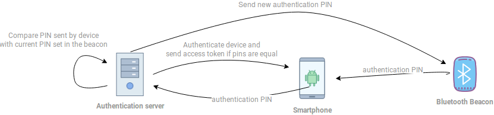

At first glance idea looks pretty simple, but there is one more thing to bare in mind. It's worth to mention that beacons on their own are pretty simple devices and cannot transmit any additional data except their unique id. Also our auth server won't be able to set some additional data directly to beacon. Having that in mind we need to somehow create an association between beacon unique identificator and one-time authentication PIN. Fortunately for us, Google provides [Google Beacon Platform](https://developers.google.com/beacons/) built on Eddystone beacon standard developed by Google themselves that allow us to register and integrate beacons in the cloud and manage "attachment content" of beacons - data associated with specific beacon. This platform also provides additional [Proximity Beacon API](https://developers.google.com/beacons/proximity/guides) that allows us to read and modify our beacon associated data. We will use this API on our backend side of our authentication server. On the client side for our mobile application we will use another API developed by Google called [Nearby Messages](https://developers.google.com/nearby/messages/overview). It is publish-subscribe type API that uses combinations of different wireless data exchange technologies like WiFi and Bluetooth LE to create communication link between various mobile devices. Client app can subscribe to Bluetooth Low Energy attachments associated with our beacon, meaning that as soon as we detect beacon using Nearby Messagges we will be able to get attachments for this particular beacon.

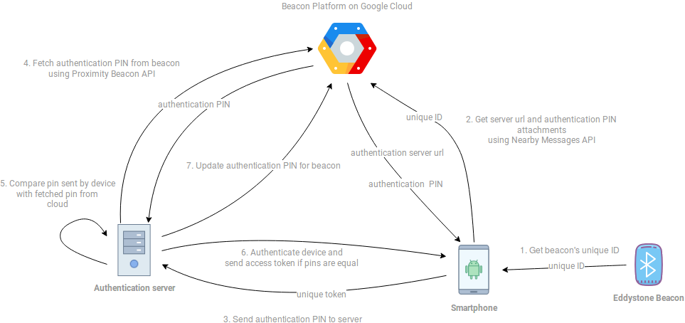

## Project setup

Before we start coding our authentication server application and mobile app client we need to setup new project in [Google API Console](https://console.developers.google.com) which will have access to Beacon Platform. First, go to [Google API Console dashboard](https://console.developers.google.com/) (log in to your Google account if you have to) and  select "Select a project" option on top bar and click "NEW PROJECT" button in dialog window.

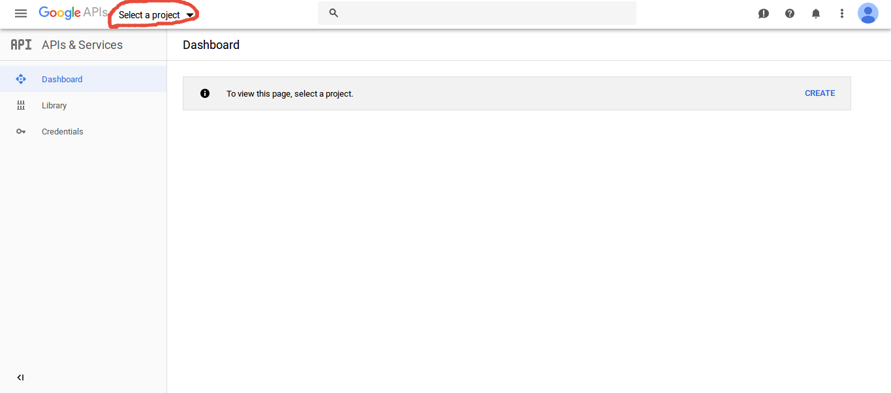
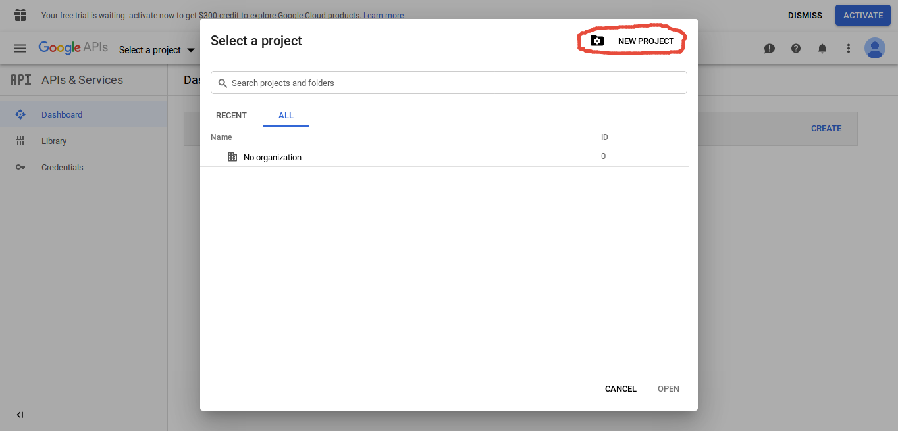

In creator name your project and give it unique ID or leave one autogenerated for you and click "Create".

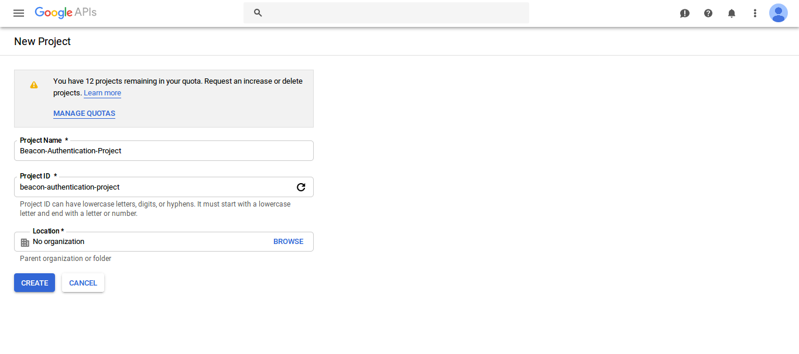

After project was created you can choose what APIs you wish to enable for it by clicking "ENABLE APIS AND SERVICES" button.

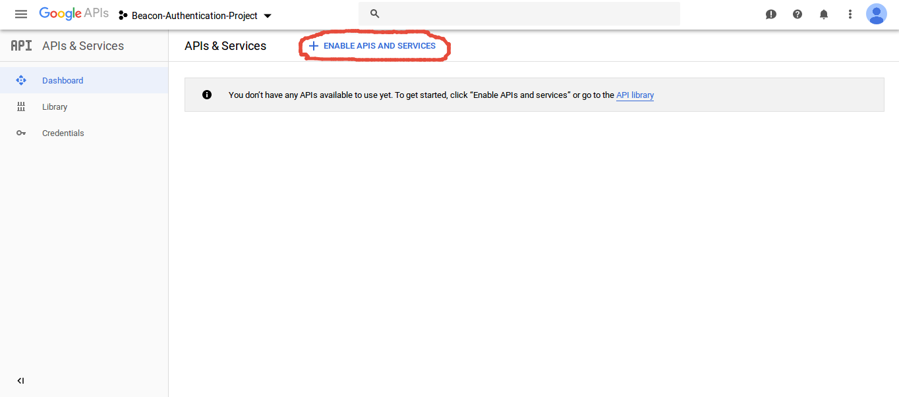

In appeared library section search for "Proximity Beacon API" and click on result to enable it.
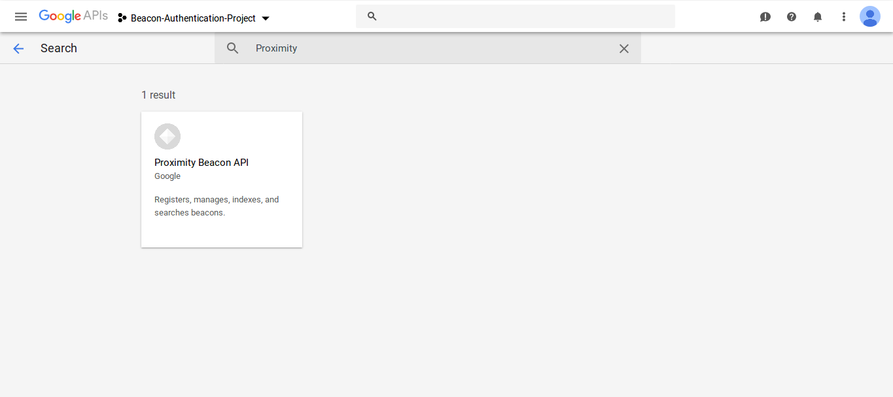
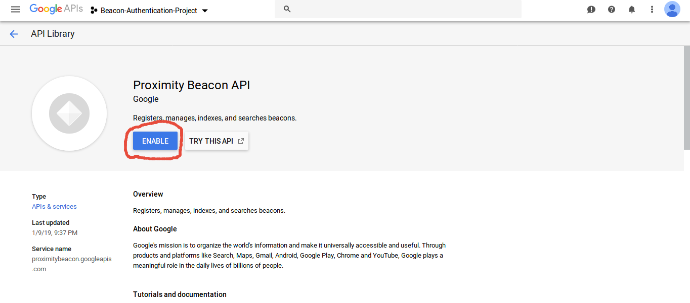

After enabling Proximity Beacon API go back to your project dashboard and enable Nearby Messages API.

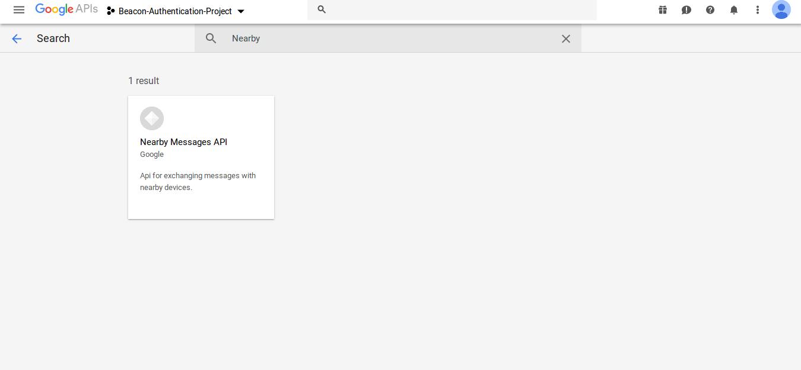
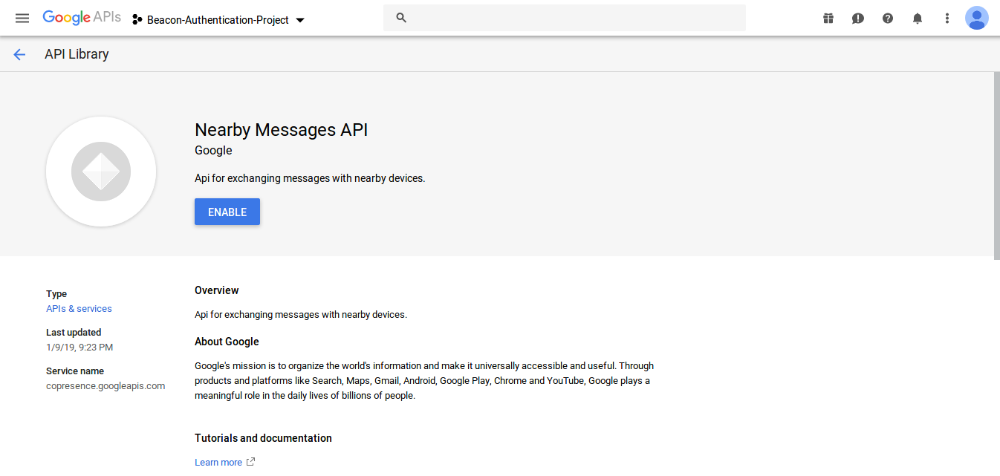

After enabling our APIs we can begin setting up our beacon in Google Beacon Platform. In our case we will be using Eddystone based [Smart Beacon SB16-2](https://store.kontakt.io/our-products/30-smart-beacon-sb16-2.html) from Kontakt.io. To register beacon we will need to install [Beacon Tools](https://play.google.com/store/apps/details?id=com.google.android.apps.location.beacon.beacontools) configuration app on Android device (device must support Bluetooth Low Enegy). After installing application log into account and choose project set up in steps ealier. 

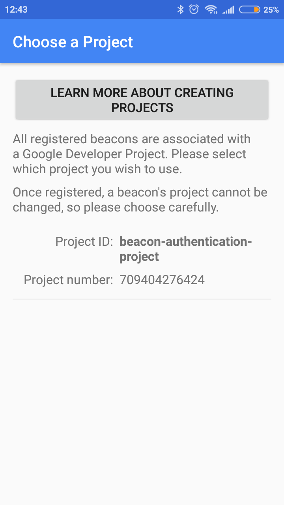

After this application should automatically start scanning for nearby beacons. If not choose "Beacons near Me" option in menu to start scanning. If application finds new beacon it will appear in list under "UNREGISTERED" tab. Scanning in some cases can take time so beacon might not appear on the list right away.

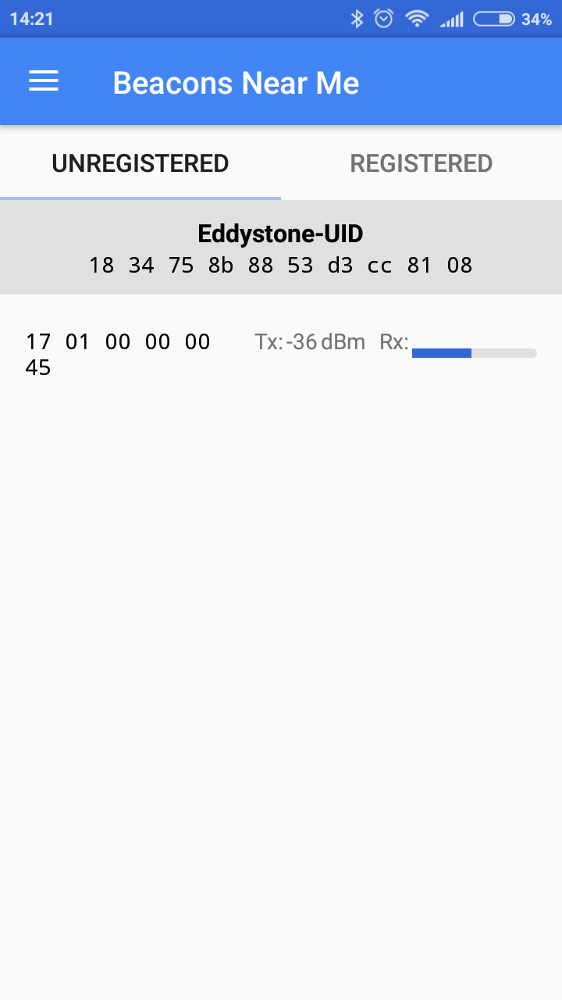

After beacon appeared in the list click on it and register it by providing description. We also want to set some initial attachments like `url` and `pin`. 

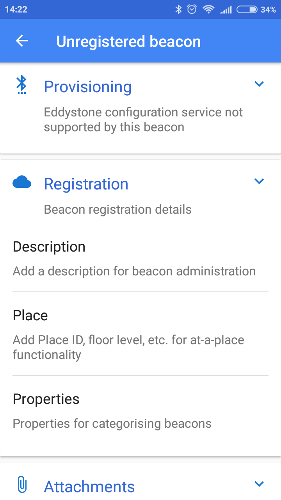
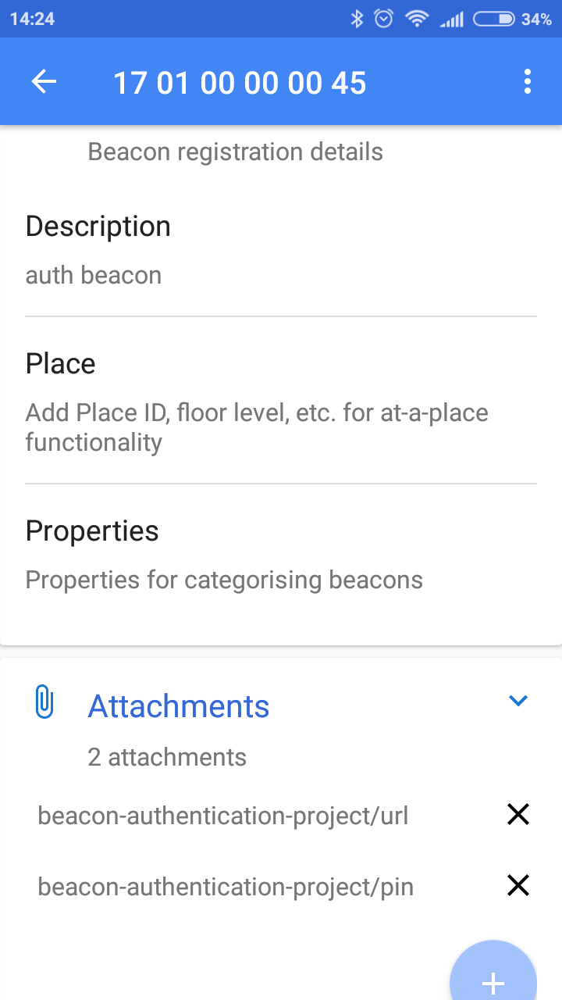

Now after beacon is registered it should appear as active beacon in [Google Beacon Platform Dashboard](https://developers.google.com/beacons/dashboard/). If we want our authentication server to have access to beacon attachments we need user to grant access to account's beacons for our web application. For this we have to generate OAuth Client ID that will be used by server to request for credentials that will be used to access Proximity Beacon API resources after application was granted access. In dashboard screen of the project choose "Credentials" from side option menu, click "Create credentials" and from dropdown choose "OAuth client ID" option.

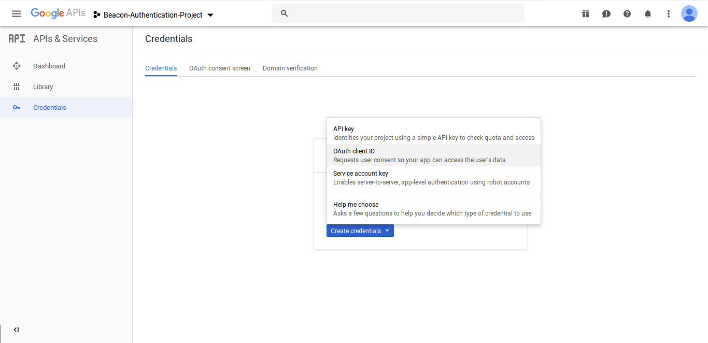

At the beggining you will need to configure consent screen for your application. This screen will be used each time your application will be asking for permission to read and modify beacons' data. In "OAuth consent screen" section of "Credentials" fill in name for your application in "Application name" field, set application logo (optional) and in the "Scopes for Google APIs" section click "Add scope" button. In dialog choose "Proximity Beacon API" option and click "ADD".

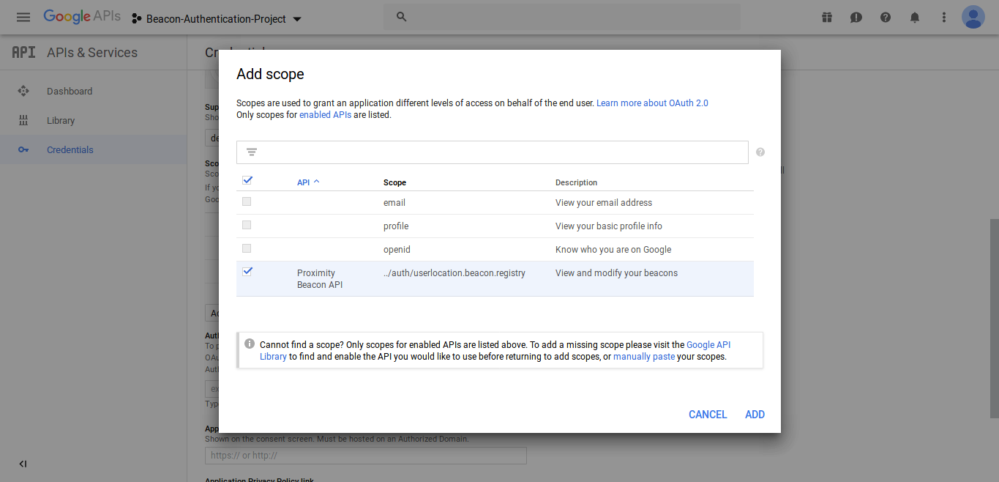

Save your settigns for consent screen and you will be automatically redirected back to OAuth Client ID creator. In creator choose "Web application" option from "Application type" option list. Next fill in name for client ID and in  "Authorized redirect URIs" section add `http://localhost/` and `http://127.0.0.1` redicrect urls and click "Create". 

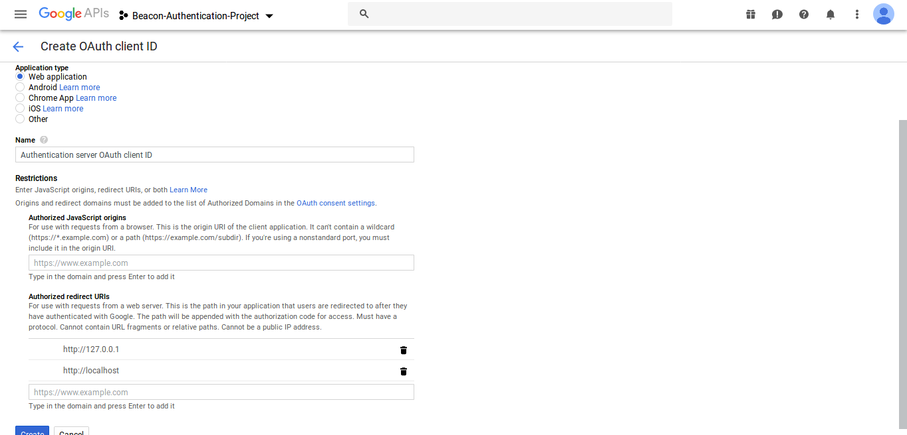

 We will also need to generate an API key for our Android application that will use Nearby Messages API. To do this in "Credentials" section click "Create credentials" button and choose "API key" option.

## Implementing authentication server

After setting up authentication beacon and generating OAuth Client ID and API key we could start developing our authentication server. In this example we will be using Python based Flask micro-framework with additional extensions/plugins. Namely we will use:

* [Flask-RESTPlus](https://flask-restplus.readthedocs.io/en/stable/) - this extension will allow us to create endpoints with interactive [Swagger UI](https://swagger.io/tools/swagger-ui/) API documentation.
* [Flask-JWT-Extended](https://flask-jwt-extended.readthedocs.io/en/latest/) - will be used to generate JWT access token for our Android mobile app client.
* [Flask-SQLAlchemy](http://flask-sqlalchemy.pocoo.org) - ORM extension that we'll use to declare database models that will be mapped to tables for storing data like: registered devices, OAuth2 credentials and JWT tokens.
* [Flask-Migrate](https://flask-migrate.readthedocs.io/en/stable/) - small utility extension that will simplify creation of database with migrations.
* [Dynaconf](https://dynaconf.readthedocs.io/en/latest/) - additional library that will allow us load settings for our Flask application from `.yaml` and `.env` config files.
* [Gunicorn](https://gunicorn.org/) - Python WSGI HTTP server for serving our authentication app.

To start off we will create folder called `beacon-auth-server` and `cd` into it:
```shell
mkdir beacon-auth-server
cd beacon-auth-server/
```
Now we need to create virtual environment for our project and install dependencies listed above. We can do this by creating environment with `virtualenv` and install packages with `pip` but to ease up things we will use [`pipenv`](https://github.com/pypa/pipenv):
```shell
# This will initialize virtual environment based on Python 3.6
$ pipenv --python 3.6
# Installing packages
$ pipenv install flask-restplus
$ pipenv install flask-jwt-extended 
$ pipenv install flask-sqlalchemy 
$ pipenv install flask-migrate
$ pipenv install dynaconf
```
Also, if we want to store configurations for app in `.yaml` file we need to install this Dynaconf dependency:
``` 
$ pipenv install dynaconf[yaml]
```

Additionally, we will need to download [Google API client for Python](https://developers.google.com/api-client-library/python/) with few packages that will help authenticate and authorize our app to use Proximity API:
```shell
$ pipenv install google-api-python-client google-auth google-auth-httplib2 google-auth-oauthlib
```
After installing all the neccessary dependencies we will create `settings.yaml` and `.secrets.yaml` files in root directory of our project.
```shell 
$ touch settings.yaml .secrets.yaml
```
The content of `settings.yaml` will look like this:
```yaml
# Default configurations that will be applied to app
# regardless what mode is activated (production or development)
default:
  # This config tells migrations extension to monitor changes
  # in database models
  SQLALCHEMY_TRACK_MODIFICATIONS: true
  # This config tells JWT extension where it should look
  # for access and refresh tokens in incoming request.
  JWT_TOKEN_LOCATION: ["json", "headers"]
  # Enables blacklisting functionality for JWT tokens
  JWT_BLACKLIST_ENABLED: true
  # Allow edit requests' json bodies in Swagger 
  SWAGGER_UI_JSONEDITOR: true
development:
  # Allow showing exceptions in browser
  DEBUG: true
production:
  # Do not show exceptions in browser
  DEBUG: false
```
In `.secrets.yaml` we will store sensitive data such as secret keys, connection strings and path to our OAuth Client ID:
```yaml
default:
  # Example: yrtgb-2whqvg-27qtebhb4-12
  SECRET_KEY: <secret-key>
  # Example: yrtgb-2whqvg-27qtebhb4-12
  JWT_SECRET_KEY: <secret-key-for-jwt-encryption>
  CLIENT_SECRETS_FILE: <path-to-downloaded-oauth-client-id>
  PROJECT_ID: <project-id-set-when-creting-project-in-google-dahsboard>
development:
  # Database URI which will be used by SQLAlchemy to communicate
  # with database. For local development we can use sqlite3:
  # Example: "sqlite:////home/user/beacon-auth-server/db.sqlite3"
  SQLALCHEMY_DATABASE_URI: <database-connection-uri>
```
Now download previosly set up OAuth2 Client ID and save it in root of your authentication server project under name `client_secrets.json`. Remember that path to `client_secrets.json` file should be same as in the `settings.yaml`.
To avoid writing everything in one python file we will make use of [Blueprints](http://flask.pocoo.org/docs/1.0/blueprints/) that would add modularity to our project and allow us to brakdown code to different modules and packages. In project's root folder we will create main application `auth_server` package with `api`, `models` and `utils` subpackages.
```shell
$ mkdir -p ./auth_server/{api,models,utils}/
$ touch ./auth_server/{api,models,utils}/__init__.py
$ touch ./auth_server/__init__.py 
.
└── auth_server
    ├── api
    │   └── __init__.py
    ├── models
    │   └── __init__.py
    ├── utils
    │   └── __init__.py
    └── __init__.py
```
`api` package is where all our application endpoints will be implemented, `models` package is where we will declare all our databse models. `utils` is the package where we will write different helping functions that would help us reduce writing boilerplate code in our endpoints. In `auth_server` package let's create python module `extensions.py` where we will store all our extensions:
```shell
$ touch ./auth_server/extensions.py
```
```python
from flask_sqlalchemy import SQLAlchemy
from flask_jwt_extended import JWTManager
from flask_migrate import Migrate

# Creating extension objects that later will be used
# by other packages and modules.
db = SQLAlchemy()
jwt = JWTManager()
migrate = Migrate()
```
After extensions are created we can start making our enpoints and database models. In `api` package create file called `views.py`.
```shell
$ touch ./auth_server/api/views.py
```
Code inside `views.py`:
```python
from flask import Blueprint

oauth2_blueprint = Blueprint('oauth2', __name__, url_prefix='/oauth2')

from auth_server.api.oauth2 import *
```
In this module we will "glue" all our API Resources into one blueprint that later we will register in Flask app. For now let's make main endpoint in `api/oauth2.py` which will be used to grant access for app to Proximity API.
```
$ touch ./auth_server/api/oauth2.py
```
```python
from flask import current_app as app
from flask import session
from flask import redirect
from flask import request
from flask import url_for
from flask import jsonify
from google_auth_oauthlib import flow

from auth_server.api.views import oauth2_blueprint
from auth_server.utils.db import add_oauth2_credentials


@oauth2_blueprint.route('/authorize')
def authorize():
    auth_flow = flow.Flow.from_client_secrets_file(
        app.config.CLIENT_SECRETS_FILE,
        scopes=['https://www.googleapis.com/auth/userlocation.beacon.registry'],
    )
    auth_flow.redirect_uri = url_for('oauth2.callback', _external=True)
    authorization_url, state = auth_flow.authorization_url(
        access_type='offline',
        include_granted_scopes='true',
    )
    session['state'] = state
    return redirect(authorization_url)


@oauth2_blueprint.route('/callback')
def callback():
    state = session['state']
    auth_flow = flow.Flow.from_client_secrets_file(
        app.config.CLIENT_SECRETS_FILE,
        scopes=OAUTH2.SCOPES,
        state=state
    )
    auth_flow.redirect_uri = url_for('oauth2.callback', _external=True)

    # Use the authorization server's response to fetch the OAuth 2.0 tokens.
    authorization_response = request.url
    auth_flow.fetch_token(authorization_response=authorization_response)

    # Store credentials in the session.
    # ACTION ITEM: In a production app, you likely want to save these
    #              credentials in a persistent database instead.
    credentials = auth_flow.credentials
    oauth2_credentials = add_oauth2_credentials(credentials)
    return jsonify(oauth2_credentials.to_dict())
```
`/authorize` is path to resource that creates "flow" that redirect us to consent screen we configured earlier where we will user for permission to work with beacons' data.`/callback` (set with `auth_flow.redirect_uri = url_for('oauth2.callback', _external=True)` in `/authorize` endpoint) is callback path where user will be redirected after granting or denying permission for our app.  You can find more detailed description for code on [OAuth 2.0 for Server-side Web Apps](https://developers.google.com/identity/protocols/OAuth2WebServer) official documentation page. After getting credentials from `auth_flow` we are saving them to database using `add_oauth2_credentials` as we don't want to repeat flow to generate credentials each time we need them. That function we will create in the moment, but first let's declare model for OAuth2 credentials in `oauth2.py` module in `models` package. 
```shell
$ touch ./auth_server/models/oauth2.py
```
```python
from google.oauth2.credentials import Credentials

from auth_server.extensions import db

scopes_m2m = db.Table(
    'scopes',
    db.Column(
        'scope_id',
        db.Integer,
        db.ForeignKey('oauth2_scopes.id'),
        primary_key=True),
    db.Column(
        'credential_id',
        db.Integer,
        db.ForeignKey('oauth2_credentials.id'),
        primary_key=True),
)


class OAuth2Scope(db.Model):
    '''
    Google OAuth2 scope for resource
    '''
    __tablename__ = 'oauth2_scopes'

    id = db.Column(db.Integer, primary_key=True)
    scope = db.Column(db.String(100), unique=True, nullable=False)

    @classmethod
    def from_scope(cls, scope):
        ''' Create OAuth2Scope model object if not exists

        :param scope: str - scope name
        :return: OAuth2Scope object
        '''
        scopes = {row.scope: row for row in cls.query.all()}
        if not scope in scopes.keys():
            return cls(scope=scope)
        return scopes[scope]


class OAuth2Credentials(db.Model):
    '''
    Google OAuth2 credentials for accessing Proximity Beacon API
    '''
    __tablename__ = 'oauth2_credentials'

    id = db.Column(db.Integer, primary_key=True)
    token_uri = db.Column(db.String(100), nullable=False)
    client_id = db.Column(db.String(100), unique=True, nullable=False)
    client_secret = db.Column(db.String(100), nullable=False)
    token = db.Column(db.String(250), nullable=False)
    refresh_token = db.Column(db.String(250), nullable=True)
    scopes = db.relationship(
        'OAuth2Scope',
        secondary=scopes_m2m,
        backref=db.backref('credentials', lazy=True),
        lazy='subquery')

    @classmethod
    def from_creds(cls, credentials):
        ''' Create model object from google.oauth2.credentials.Credentials

        :param credentials: google.oauth2.credentials.Credentials object
        :return: OAuth2Credential object
        '''
        client_id = credentials.client_id
        scopes = credentials.scopes
        token = credentials.token
        refresh_token = credentials.refresh_token
        client_secret = credentials.client_secret
        token_uri = credentials.token_uri
        oauth2_scopes = [OAuth2Scope.from_scope(scope) for scope in scopes]
        oauth2_credential = OAuth2Credentials(
            client_id=client_id,
            token_uri=credentials.token_uri,
            client_secret=credentials.client_secret,
            token=credentials.token,
            refresh_token=credentials.refresh_token
        )
        for oauth2_scope in oauth2_scopes:
            oauth2_credential.scopes.append(oauth2_scope)
        return oauth2_credential

    def get_creds(self):
        ''' Get google.oauth2.credentials.Credentials object
        from model's object

        :return: google.oauth2.credentials.Credentials object
        '''
        return Credentials(**self.to_dict())

    def to_dict(self):
        return {
            'token_uri': self.token_uri,
            'client_id': self.client_id,
            'client_secret': self.client_secret,
            'token': self.token,
            'refresh_token': self.refresh_token,
            'scopes': [s.scope for s in self.scopes]
        }
```
After OAuth2 models are declared we can create file `db.py` in `auth_server/utils` and add `add_oauth2_credentials` function:
```shell
$ touch ./auth_server/utils/db.py
```
```python
from auth_server.extensions import db
from auth_server.models.oauth2 import OAuth2Credentials
from auth_server.models.oauth2 import OAuth2Scope


def add_oauth2_credentials(credentials):
    ''' Add OAuth2 credentials to database if they do not
    exist in it.

    :param credentials: google.oauth2.credentials.Credentials object
    :return: OAuth2Credential object 
    '''
    oauth2_credentials = OAuth2Credentials.query.filter_by(
        client_id=credentials.client_id).first()
    model_updated = False
    if not oauth2_credentials:
        oauth2_credentials = OAuth2Credentials.from_creds(credentials)
        db.session.add(oauth2_credentials)
        model_updated = True
    else:
        for scope in credentials.scopes:
            oauth2_scope = OAuth2Scope.from_scope(scope)
            if oauth2_scope not in oauth2_credentials.scopes:
                oauth2_credentials.scopes.append(oauth2_scope)
                model_updated = True
        if oauth2_credentials.refresh_token is None:
            oauth2_credentials.refresh_token = credentials.refresh_token
            model_updated = True
    if model_updated:
        db.session.commit()
    return oauth2_credentials


def get_default_credentials():
    ''' Returns default OAuth2 credentials from database used
    to fetch data from Google API.

    :return: google.oauth2.credentials.Credentials object
    '''
    oauth2_credentials = OAuth2Credentials.query.filter(
        OAuth2Credentials.refresh_token.isnot(None)).first()
    if not oauth2_credentials:
        return None
    return oauth2_credentials.get_creds()
```
Here we're also adding function `get_default_credentials` that returns credentials from database that we addded in `/callback` endpoint. Now after setting up OAuth2 endpoints we can register blueprint associated with them. In `auth_server` folder create `app.py` file. Here we will setup our application and initialize all extensions and views/endpoints for our Flask application
```shell
$ touch ./auth_server/app.py
```
```python
import os

from flask import Flask
from dynaconf import FlaskDynaconf

from auth_server.extensions import db
from auth_server.extensions import jwt
from auth_server.extensions import ma
from auth_server.extensions import migrate
from auth_server.api.views import oauth2_blueprint


def configure_app(app):
    '''
    Configure app settings.
    '''
    FlaskDynaconf(app)


def init_extensions(app):
    '''
    Initialize Flask extensions.
    '''
    db.init_app(app)
    migrate.init_app(app, db)
    jwt.init_app(app)
    ma.init_app(app)


def register_blueprints(app):
    '''
    Register blueprints for app.
    '''
    app.register_blueprint(oauth2_blueprint)


def create_app():
    ''' 
    Create new Flask app instance.
    '''
    app = Flask('beacon-auth-server')
    configure_app(app)
    init_extensions(app)
    register_blueprints(app)
    if app.config.ENV != 'production':
        os.environ['OAUTHLIB_INSECURE_TRANSPORT'] = '1'
    return app
```
`create_app` function builds up our Flask application and returns its instance. `init_extensions` links all our extensions with application instance and `register_bleuprints` adds view blueprints to app instance. By default `google-auth-oauthlib`  library don't allow callbacks over unsecure http connections but for development purposes we can ignore that by setting environmental variable `OAUTHLIB_INSECURE_TRANSPORT` value to 1. Now we will create `wsgi.py` file in `auth_server` directory where we will create instance of our app that then can be served by Flask development server or gunicorn.
```shell
$ touch ./auth_server/wsgi.py/
```
```python
from .app import create_app

app = create_app()
```
To run flask development server with `flask run` command we will create file `.env` and set following variables:
```shell
FLASK_APP='auth_server.wsgi:app'
FLASK_ENV='development'
```
This file will be automatically regonized by Dynaconf extension when application starts. Last thing to do before running server is to initialize database and migrate our database models.
```shell
# Initialize migrations 
$ pipenv run flask db init
$ pipenv run flask db migrate
# Apply changes
$ pipenv run flask db upgrade
```
Run server:
```shell
$ pipenv run flask run
```
Now we can got to [/authorize]https://127.0.0.1/oauth2/authorize endpoint where we will be asked to choose account and grant access to our "Beacon Authentication App". We choose "Allow". Now if authorization process succeded we should see json body of our credentials granted by Google auth server.
After we successfully implemented OAuth2 enpoint we can start developing actual logic of our beacon authentication server. Let's create module called `beacons.py` in our `utils` package.
```shell
$ touch ./auth_server/utils/beacons.py
```
In this module we will create custom Flask extension that will integrate our app with Google API Client.
```python
import base64
from googleapiclient import discovery


class ProximityBeaconAPI:
    '''
    Simple Flask extension for accessing Google Proxmity Beacon API.
    https://developers.google.com/resources/api-libraries/documentation/proximitybeacon/v1beta1/python/latest/
    '''

    def __init__(self, app=None, credentials=None):
        if app:
            self.init_app(app)
        if credentials:
            self.init_api(credentials)

    def init_app(self, app):
        '''
        Initialize Flask app for extension
        '''
        self.app = app
        self._project_id = app.config.PROJECT_ID

    @property
    def api(self):
        '''
        If is initialized returns Google API client instance.

        :return: bool
        '''
        if not hasattr(self, 'app'):
            return None
        return self.app.extensions.get('api')

    def init_api(self, credentials):
        ''' Initialize Proximity Beacon API

        :param credentials: google.oauth2.credentials.Credentials object  
        '''
        proximitybeaconapi = discovery.build(
            'proximitybeacon', 'v1beta1', credentials=credentials)
        self.app.extensions['api'] = proximitybeaconapi

    def get_default_auth_beacon_name(self):
        ''' Returns name of the beacon which property "auth" is set to 
        "true".

        :return: beacon name
        '''
        if hasattr(self, '_default_beacon_name'):
            return self._default_beacon_name
        api = self.app.extensions.get('api')
        query = 'status:active'
        response = api.beacons().list(q=query).execute()
        # Caching variable
        self._default_beacon_name = response['beacons'][0]['beaconName']
        return self._default_beacon_name

    def get_default_project_namespace(self):
        ''' Returns name of default namespace for attachments

        :return: default namespace name
        '''
        if hasattr(self, '_default_project_namespace'):
            return self._default_project_namespace
        api = self.app.extensions.get('api')
        query = {'projectId': self._project_id}
        resp = api.namespaces().list(**query).execute()
        # Caching variable
        self._default_project_namespace = resp['namespaces'][0][
            'namespaceName']
        return self._default_project_namespace

    def get_pin(self):
        ''' Returns beacon's current pin attachment value.

        :param beacon_name: name of the beacon
        :param namespace: namespace
        '''
        beacon_name = self.get_default_auth_beacon_name()
        api = self.app.extensions.get('api')
        namespace = self.get_default_project_namespace().split('/')[1]
        namespaced_type = '{}/pin'.format(namespace)
        query = {'beaconName': beacon_name, 'namespacedType': namespaced_type}
        resp = api.beacons().attachments().list(**query).execute()
        b64_data = resp['attachments'][0]['data']
        return self._base64_to_str(b64_data)

    def is_pin_valid(self, pin):
        ''' Checks if recieved pin is valid with current
        pin attachment.

        :param pin: incomming pin
        :return: True or False
        '''
        request_pin = self._base64_to_str(pin)
        current_pin = self.get_pin()
        return request_pin == current_pin

    def unset_pin(self):
        ''' Unsets "pin" type attachment on authentication beacon identified
        by beacon_name.
        '''
        beacon_name = self.get_default_auth_beacon_name()
        api = self.app.extensions.get('api')
        namespace = self.get_default_project_namespace().split('/')[1]
        namespaced_type = '{}/pin'.format(namespace)
        query = {
            'beaconName': beacon_name,
            'namespacedType': namespaced_type,
        }
        resp = api.beacons().attachments().batchDelete(**query).execute()
        return resp

    def set_pin(self, pin):
        ''' Sets "pin" type attachment on authentication beacon identified
        by beacon_name.

        :param pin: unique pin
        '''
        beacon_name = self.get_default_auth_beacon_name()
        api = self.app.extensions.get('api')
        namespace = self.get_default_project_namespace().split('/')[1]
        namespaced_type = '{}/pin'.format(namespace)
        if self.get_pin() is not None:
            self.unset_pin()
        query = {
            'beaconName': beacon_name,
            'projectId': self._project_id,
            'body': {
                'namespacedType': namespaced_type,
                'data': self._str_to_base64(pin),
            }
        }
        resp = api.beacons().attachments().create(**query).execute()
        return resp

    def _base64_to_str(self, data):
        '''
        Encode string data to base64 string.
        '''
        return base64.b64decode(data.encode()).decode()

    def _str_to_base64(self, data):
        '''
        Decode base64 string to Python string.
        '''
        pin_bytes = str.encode(data)
        return base64.b64encode(pin_bytes).decode()
```
Exaplanation to code above:
In extension's class `ProximityBeaconAPI` we create `init_app` method that links it with Flask app similarly like in other extensions like `Flask-SQLAlchemy`. `init_api` method is where we initialize API client and set it in app's `extensions` dictionary. When we recieve pin (base64 encoded) from mobile app we will check its validity with `is_pin_valid` method  which fetches current pin using `get_pin` method. If it is valid we will unset current pin with `unset_pin` method and generate new pin and set it with `set_pin` method. `get_default_project_namespace` and `get_default_auth_beacon_name` are used for fetching neccessary data to construct reuquset query to Proximity Beacon API. Now we can add our extension in `extensions.py` file and initialize it in `app.py`:

`extensions.py`:
```python
from flask_sqlalchemy import SQLAlchemy
from flask_jwt_extended import JWTManager
from flask_migrate import Migrate
from auth_server.utils.beacons import ProximityBeaconAPI

# Creating extension objects that later will be used
# by other packages and modules.
db = SQLAlchemy()
jwt = JWTManager()
migrate = Migrate()
beaconapi = ProximityBeaconAPI()
```

`app.py`:
```python

from auth_server.extensions import beaconapi

...

def init_extensions(app):
    '''
    Initialize Flask extensions.
    '''
    db.init_app(app)
    migrate.init_app(app, db)
    jwt.init_app(app)
    ma.init_app(app)
    # Initializing Proximity Beacon API
    beaconapi.init_app(app)

```
Let's now start implementing device registration endpoint. In `api` package create file called `devices.py` and write following code:
```python
import random

from flask import current_app as app
from flask_jwt_extended import create_access_token
from flask_restplus import Namespace, Resource, fields

from auth_server.extensions import beaconapi
from auth_server.utils.db import (add_device_token,
                                  add_new_device_if_not_exists,
                                  get_default_credentials)

devices_namespace = Namespace(
    'devices', description='Endpoint for interaction with bluetooth devices.')

# Fields
access_token_field = fields.String(
    description='Access token', example='eyJhbGciOiJIUzI1NiIsInR5cCI6IkpXVCJ9')
refresh_token_field = fields.String(
    description='Refresh token', example='IkpXVCJ9.eyJpZGVudGl0eSI6InlvdX')

# Login models
register_reguest_model = devices_namespace.model(
    'Device registration request', {
        'pin': fields.String(description='Base64 encoded token'),
        'device': fields.String(description='Device name'),
        'model': fields.String(description='Model name'),
        'manufacturer': fields.String(description='Manufacturer of device'),
        'product': fields.String(description='Product name'),
    })

register_response_model = devices_namespace.model(
    'Device registration  response', {
        'message': fields.String(description='Response message'),
        'access_token': access_token_field
    })


@devices_namespace.route('/register')
class Register(Resource):
    '''
    Device regestration endpoint.
    '''

    @devices_namespace.expect(register_reguest_model)
    @devices_namespace.marshal_with(register_response_model)
    def post(self):
        data = devices_namespace.payload
        pin = data.pop('pin')
        if not beaconapi.api:
            beaconapi.init_api(get_default_credentials())
        if not beaconapi.is_pin_valid(pin):
            return {'message': 'PIN is invalid'}, 403
        device = add_new_device_if_not_exists(data)
        access_token = create_access_token(device.id)
        add_device_token(access_token, app.config.JWT_IDENTITY_CLAIM)
        new_pin = str(random.randint(1, 999999999))
        beaconapi.set_pin(new_pin)
        return {
            'message': 'SUCCESS',
            'access_token': access_token,
        }, 200
```
Here we've created `Namespace` object that creates new endpoint. We also create  `register_request_model` and `register_response_model` that will be used to document endpoint in Swagger UI. Here we see few additional functions like `add_new_device_if_not_exists` that based on json body creates new device instance and  `add_device_token` that links generated by `flask_jwt_extended` library acceess_token and device model instance. These functions are not yet created and we will implement them in `utils/db.py` module, but first we will create database models for our registered devices and generated tokens in `auth.py` module in `models` package.
```shell
$ touch ./auth_server/models/auth.py
```
```python
from auth_server.extensions import db


class Device(db.Model):
    '''
    Model for storing data about devices
    '''
    __tablename__ = 'devices'

    id = db.Column(db.Integer, primary_key=True)
    device = db.Column(db.String(50), nullable=False)
    model = db.Column(db.String(50), nullable=True)
    brand = db.Column(db.String(50), nullable=True)
    manufacturer = db.Column(db.String(50), nullable=True)
    product = db.Column(db.String(100), nullable=True)
    tokens = db.relationship('JWToken', backref='device', lazy='dynamic')


class JWToken(db.Model):
    '''
    Model for storing JWT authorization tokens.
    '''

    __tablename__ = 'tokens'

    id = db.Column(db.Integer, primary_key=True)
    jti = db.Column(db.String(36), nullable=False, unique=True)
    token_type = db.Column(db.String(10), nullable=False)
    device_id = db.Column(
        db.Integer, db.ForeignKey('devices.id'), nullable=True)
    expires = db.Column(db.DateTime, nullable=False)
    revoked = db.Column(db.Boolean, nullable=False)
```
Now in `auth_server/utils/db.py` let's add `add_new_device_if_not_exists` and  `add_device_token` functions:
```python
from datetime import datetime

from flask_jwt_extended import decode_token
from auth_server.models.auth import Device, JWToken
...

def add_device_token(encoded_token, identity_claim):
    '''
    Adds a new token to the database. It is not revoked when it is added.

    :param identity_claim: configured key to get user identity
    '''
    decoded_token = decode_token(encoded_token)
    jti = decoded_token['jti']
    token_type = decoded_token['type']
    user_identity = decoded_token[identity_claim]
    expires = datetime.fromtimestamp(decoded_token['exp'])
    revoked = False

    token = JWToken(
        jti=jti,
        token_type=token_type,
        device_id=user_identity,
        expires=expires,
        revoked=revoked,
    )
    db.session.add(token)
    db.session.commit()


def add_new_device_if_not_exists(data):
    '''
    Helper function for adding new device to database.

    :param data: device data
    :return: Device instance
    '''
    device = Device.query.filter_by(**data).first()
    if not device:
        device = Device(**data)
        db.session.add(device)
        db.session.commit()
    return device
```
Now in `views.py` we need to import `device_namespace` and create REST API instance and add it to new blueprint:
`views.py`
```python
from flask import Blueprint
from flask_restplus import Api

from auth_server.api.devices import devices_namespace

api_blueprint = Blueprint('api', __name__, url_prefix='/api')

api = Api(
    api_blueprint,
    title='Beacon authentication server',
    version='1.0-dev',
    description='REST API for beacon authentication server.')

api.add_namespace(devices_namespace, path='/devices')

oauth2_blueprint = Blueprint('oauth2', __name__, url_prefix='/oauth2')

from auth_server.api.oauth2 import *
```
Don't forget to register blueprint in `app.py`:
`app.py`
```python
from auth_server.api.views import api_blueprint

...

def register_blueprints(app):
    '''
    Register blueprints for app.
    '''
    # Registering api blueprint
    app.register_blueprint(api_blueprint)
    app.register_blueprint(oauth2_blueprint)

```
Now after we finished implementing device registration endpoint we apply migrations as we created new models and run server to check if our API works.
```shell
$ pipenv run flask db migrate
$ pipenv run flask db upgrade
```
Run server. API documentation should be available at http://127.0.0.1/api/
```
$ pipenv run flask run
```

We will also additionally create protected endpoint in `api/maintenance.py`. This endpoint expects acccess token and return current system time of server to client.
```shell
$ touch ./auth_server/api/maintenance.py
```
```python
import time
from flask_restplus import Namespace

from flask_restplus import Resource
from flask_restplus import fields
from flask_jwt_extended import jwt_required

maintanance_namespace = Namespace(
    'maintanance', description='Endpoint for server common maintanance.')

systime_response = maintanance_namespace.model(
    'System time  response', {
        'time':
        fields.String(
            description='Server time',
            example='Monday March, 04 2019 20:55:33'),
    })


@maintanance_namespace.route('/systime')
class SysTime(Resource):
    '''
    System time endpoint
    '''

    @jwt_required
    @maintanance_namespace.marshal_with(systime_response)
    def get(self):
        return {'time': time.strftime('%A %B, %d %Y %H:%M:%S')}
```
Import endpoint's namespace to `views.py` and add to API:
```python
from flask import Blueprint
from flask_restplus import Api

from auth_server.api.devices import devices_namespace
from auth_sever.api.maintanance import maintanance_namespace

api_blueprint = Blueprint('api', __name__, url_prefix='/api')

api = Api(
    api_blueprint,
    title='Beacon authentication server API',
    version='1.0-dev',
    description='REST API for beacon authentication server.')

api.add_namespace(devices_namespace, path='/devices')
api.add_namespace(maintanance_namespace, path='/maintanance')

oauth2_blueprint = Blueprint('oauth2', __name__, url_prefix='/oauth2')
```

## Implementing Android application

After we finished backend server part we can start developing Android client. We will need Android Studio and Android SDK installed on our local development machine. Create new Android Studio Project with default configurations provided by project creator. Before we proceed with implementation we will need to include few dependencies in `build.gradle` file:

```gradle
dependencies {
    implementation fileTree(dir: 'libs', include: ['*.jar'])
    implementation 'androidx.appcompat:appcompat:1.0.2'
    implementation 'androidx.constraintlayout:constraintlayout:1.1.3'
    implementation 'androidx.preference:preference:1.0.0'
    implementation 'com.google.android.material:material:1.1.0-alpha02'
    implementation 'com.github.ybq:Android-SpinKit:1.2.0'
    implementation 'com.jakewharton:butterknife:10.0.0'
    implementation 'com.squareup.retrofit2:retrofit:2.5.0'
    implementation 'com.squareup.retrofit2:converter-gson:2.4.0'
    implementation 'com.squareup.okhttp3:okhttp:3.12.1'
    implementation 'com.google.code.gson:gson:2.8.5'
    implementation 'com.google.android.gms:play-services-nearby:16.0.0'
    annotationProcessor 'com.jakewharton:butterknife-compiler:10.0.0'
}
```
This will download Nearby Messages API, Retrofit Java REST API Client, ButterKnife for binding views in activities and UI libraries. As we will be using smartphone's Bluetooth we will need to enable permissions for our app in `AndroidManifest.xml` file:

```xml
<manifest xmlns:android="http://schemas.android.com/apk/res/android"
    xmlns:tools="http://schemas.android.com/tools"
    package="com.beaconauth.androidapp">


    <uses-permission android:name="android.permission.INTERNET" />
    <uses-permission android:name="android.permission.BLUETOOTH" />
    <uses-permission android:name="android.permission.BLUETOOTH_ADMIN" />
    <uses-permission android:name="android.permission.ACCESS_COARSE_LOCATION" />
    <uses-permission android:name="android.permission.ACCESS_FINE_LOCATION" />
    <uses-permission android:name="android.permission.CHANGE_WIFI_STATE" />

    <uses-feature
        android:name="android.hardware.bluetooth_le"
        android:required="true" />
     ...

```
We will also need add API key generated in earlier Project's Dashboard for Nearby Messages API in `<application>` body:
```xml
<application
        android:allowBackup="true"
        android:icon="@mipmap/ic_launcher"
        android:label="@string/app_name"
        android:roundIcon="@mipmap/ic_launcher_round"
        android:supportsRtl="true"
        android:theme="@style/AppTheme">
        <meta-data
            android:name="com.google.android.nearby.messages.API_KEY"
            android:value="<your-generated-api-key>" />
        
        ...
```
Now sync gradle project. Next, we will add views to `activity_main.xml` file in `app/src/main/res/layout`:
```xml
<?xml version="1.0" encoding="utf-8"?>
<androidx.constraintlayout.widget.ConstraintLayout xmlns:android="http://schemas.android.com/apk/res/android"
    xmlns:app="http://schemas.android.com/apk/res-auto"
    xmlns:tools="http://schemas.android.com/tools"
    android:layout_width="match_parent"
    android:layout_height="match_parent"
    tools:context=".ui.MainActivity">

    <com.github.ybq.android.spinkit.SpinKitView
        xmlns:app="http://schemas.android.com/apk/res-auto"
        android:id="@+id/spin_kit"
        style="@style/SpinKitView.Large.Pulse"
        android:visibility="invisible"
        android:layout_width="wrap_content"
        android:layout_height="wrap_content"
        android:layout_gravity="center"
        android:layout_marginStart="8dp"
        android:layout_marginTop="8dp"
        android:layout_marginEnd="8dp"
        android:layout_marginBottom="8dp"
        app:SpinKit_Color="@color/colorAccent"
        app:layout_constraintBottom_toBottomOf="parent"
        app:layout_constraintEnd_toEndOf="parent"
        app:layout_constraintStart_toStartOf="parent"
        app:layout_constraintTop_toTopOf="parent" />

    <TextView
        android:id="@+id/loadingText"
        style="@style/TextAppearance.AppCompat.Small"
        android:layout_width="wrap_content"
        android:layout_height="wrap_content"
        android:layout_marginStart="8dp"
        android:layout_marginTop="8dp"
        android:layout_marginEnd="8dp"
        android:text="Loading..."
        android:visibility="invisible"
        app:layout_constraintEnd_toEndOf="parent"
        app:layout_constraintStart_toStartOf="parent"
        app:layout_constraintTop_toBottomOf="@+id/spin_kit" />

    <com.google.android.material.floatingactionbutton.FloatingActionButton
        android:id="@+id/fab"
        android:layout_width="wrap_content"
        android:layout_height="wrap_content"
        android:layout_gravity="end|bottom"
        android:layout_margin="16dp"
        android:src="@drawable/ic_bluetooth_searching_24dp"
        android:layout_marginEnd="24dp"
        android:clickable="true"
        app:layout_constraintBottom_toBottomOf="parent"
        app:layout_constraintEnd_toEndOf="parent" />


    <Button
        android:id="@+id/loginButton"
        android:layout_width="wrap_content"
        android:layout_height="wrap_content"
        android:layout_marginTop="8dp"
        android:layout_marginBottom="8dp"
        android:text="Register"
        app:layout_constraintBottom_toBottomOf="parent"
        app:layout_constraintEnd_toEndOf="parent"
        app:layout_constraintStart_toStartOf="parent"
        app:layout_constraintTop_toBottomOf="@+id/loadingText" />

    <TextView
        android:id="@+id/urlTextView"
        style="@style/TextAppearance.AppCompat.Small"
        android:layout_width="wrap_content"
        android:layout_height="19dp"
        android:layout_marginStart="8dp"
        android:layout_marginTop="128dp"
        android:layout_marginEnd="8dp"
        android:text="N/A"
        app:layout_constraintEnd_toEndOf="parent"
        app:layout_constraintStart_toStartOf="parent"
        app:layout_constraintTop_toTopOf="parent" />

    <TextView
        android:id="@+id/sysTimeTextView"
        android:layout_width="wrap_content"
        android:layout_height="wrap_content"
        android:layout_marginStart="8dp"
        android:layout_marginTop="8dp"
        android:layout_marginEnd="8dp"
        android:layout_marginBottom="8dp"
        android:text="N/A"
        app:layout_constraintBottom_toTopOf="@+id/spin_kit"
        app:layout_constraintEnd_toEndOf="parent"
        app:layout_constraintStart_toStartOf="parent"
        app:layout_constraintTop_toBottomOf="@+id/urlTextView" />

</androidx.constraintlayout.widget.ConstraintLayout>
```
Now in Java src folder let's create directory called `api`. Here we will store utility classes that will interact with authentication server's REST API. In `api` directory let's create file called `RestApiClient.java` and declare client's interface.
```java
package com.s14075.automoticzapp.api;

import com.s14075.automoticzapp.api.requests.LoginRequest;
import com.s14075.automoticzapp.api.responses.LoginResponse;
import com.s14075.automoticzapp.api.responses.SysTimeReponse;

import retrofit2.Call;
import retrofit2.http.Body;
import retrofit2.http.GET;
import retrofit2.http.Header;
import retrofit2.http.POST;

public interface RestApiClient {

    @POST("/api/devices/register")
    Call<LoginResponse> login(@Body LoginRequest request);

    @GET("/api/maintanance/systime")
    Call<SysTimeReponse> systime(@Header("Authorization") String authHeader);

}
```
Now in `api` directory create subfolders `requests` and `responses` where we will declare models that Retrofit will as serializers for incoming and ongoing data.
For `login` enpoint we will create `LoginRequest.java` file in `requests` directory and `LoginResponse.java` in `responses` directory.
`LoginRequest.java`:
```java
package com.s14075.automoticzapp.api.requests;

import com.google.gson.annotations.Expose;
import com.google.gson.annotations.SerializedName;

public class LoginRequest
{
    @SerializedName("pin")
    @Expose
    private String pin;

    @SerializedName("manufacturer")
    @Expose
    private String manufacturer;

    @SerializedName("product")
    @Expose
    private String product;

    @SerializedName("model")
    @Expose
    private String model;

    @SerializedName("device")
    @Expose
    private String device;

    public LoginRequest(){}


    public LoginRequest(String pin, String manufacturer, String product, String model, String device)
    {
        this.pin = pin;
        this.manufacturer = manufacturer;
        this.product = product;
        this.model = model;
        this.device = device;
    }

    public String getPin() {
        return pin;
    }

    public void setPin(String pin) {
        this.pin = pin;
    }

    public String getManufacturer() {
        return manufacturer;
    }

    public void setManufacturer(String manufacturer) {
        this.manufacturer = manufacturer;
    }

    public String getProduct() {
        return product;
    }

    public void setProduct(String product) {
        this.product = product;
    }

    public String getModel() {
        return model;
    }

    public void setModel(String model) {
        this.model = model;
    }

    public String getDevice() {
        return device;
    }

    public void setDevice(String device) {
        this.device = device;
    }
}
```
`LoginResponse.java`:
```java
package com.s14075.automoticzapp.api.responses;

import com.google.gson.annotations.Expose;
import com.google.gson.annotations.SerializedName;

public class LoginResponse {
    @SerializedName("message")
    @Expose
    private String message;

    @SerializedName("access_token")
    @Expose
    private String accessToken;

    public LoginResponse(String accessToken, String message) {
        this.accessToken = accessToken;
        this.message = message;
    }

    public LoginResponse() {
    }

    public String getAccessToken() {
        return accessToken;
    }

    public void setAccessToken(String accessToken) {
        this.accessToken = accessToken;
    }

    public String getMessage() {
        return message;
    }

    public void setMessage(String message) {
        this.message = message;
    }
}
```
We note here that our request and response classes should be made as Java beans with empty constructor and getters and setters for fields. `@Expose` tells us that field with this annotation should be present in json body and `@SerializedName` tells us under what name that field should be serialized. For `systime` endpoint we will only need to specify response body.
`SysTimeResponse.java`:
```java
package com.s14075.automoticzapp.api.responses;

import com.google.gson.annotations.Expose;
import com.google.gson.annotations.SerializedName;

public class SysTimeReponse
{
    @SerializedName("time")
    @Expose
    private String time;

    public SysTimeReponse(){}

    public SysTimeReponse(String time) {
        this.time = time;
    }

    public String getTime() {
        return time;
    }

    public void setTime(String time) {
        this.time = time;
    }
}
```
Next in `api` directory let's create `RestApiFactory.java` file that will be responsible for instance creation and  initializion of our REST client.
`RestApiFactory.java`:
```java
package com.s14075.automoticzapp.api;

import android.content.SharedPreferences;

import retrofit2.Retrofit;
import retrofit2.converter.gson.GsonConverterFactory;

public class RestApiFactory {
    private static RestApiClient client;


    public static RestApiClient getClient(String apiURL) {
        Retrofit retrofit = new Retrofit.Builder()
                .baseUrl(apiURL)
                .addConverterFactory(GsonConverterFactory.create())
                .build();
        return retrofit.create(RestApiClient.class);
    }

    public static String getAccessToken(SharedPreferences preferences) {
        return preferences.getString("access_token", null);
    }

    public static void saveAccessToken(String token, SharedPreferences preferences) {
        SharedPreferences.Editor editor = preferences.edit();
        editor.putString("access_token", token);
        editor.apply();
    }
}
```
In client factory we will also create method that saves access token to `SharedPreferences` and method that gets saved token from `SharedPreferences`. Now we can put everuthing together in `MainActivity.java`. We start from declaring view fields used that will be used in our activity and some constants:
```java
public class MainActivity extends AppCompatActivity {

    private static final String LOG_TAG = MainActivity.class.getSimpleName();
    private static final int MY_PERMISSIONS_REQUEST_LOCATION = 1045;
    private static final int MY_PERMISSIONS_REQUEST_WIFI = 1046;
    private static boolean LOGGED = false;

    private MessageListener mMessageListener;

    @BindView(R.id.fab)
    FloatingActionButton fab;

    @BindView(R.id.spin_kit)
    SpinKitView progressBar;

    @BindView(R.id.loadingText)
    TextView loadingText;

    @BindView(R.id.urlTextView)
    TextView urltextView;

    @BindView(R.id.sysTimeTextView)
    TextView sysTimeTextView;

    @BindView(R.id.loginButton)
    TextView loginButton;
```
`mMessageListener` (which we will implement in `onCreate` method later) will be responsible for processing incoming attachments from beacon. When users launches application he will see `fab` floating button. Upon clicking that button app starts scanning for nearby messages broadcasted by beacons. Here we are creating `onClick` method for button that will start scanning:

```java
// Floating button onClick listener
@OnClick(R.id.fab)
public void onFabClick() {
    clearPreferences();
    this.lookForNearbyMessages();
}

private void lookForNearbyMessages() {
    if (canInteractWithBeacons()) {
        this.showLoadingStatus();
        this.subscribe();
    }
}

private void showLoadingStatus() {
    this.progressBar.setVisibility(View.VISIBLE);
    this.loadingText.setVisibility(View.VISIBLE);
}

private void hideLoadingStatus() {
    this.progressBar.setVisibility(View.INVISIBLE);
    this.loadingText.setVisibility(View.INVISIBLE);
}

private void clearPreferences() {
    SharedPreferences sp = PreferenceManager.getDefaultSharedPreferences(this);
    SharedPreferences.Editor editor = sp.edit();
    String apiUrlKey = "url";
    String pinKeyName = "pin";
    editor.remove(apiUrlKey);
    editor.remove(pinKeyName);
    editor.apply();
}
```
First in `onClick` methid we are resseting `url` and `pin` values saved in `SharedPreferences` if there are any. After that we check if our application has enough permissions to start monitoring for beacon's messages.
```java
private boolean canInteractWithBeacons() {
        if (!isFineOrCoarseLocationPermissionGranted() && Build.VERSION.SDK_INT >= Build.VERSION_CODES.M) {
            requestCoarseLocationPermission();
            return false;
        }
        if (!isChangeWifiStatePermissionGranted())
            requestChangeWifiStatePermission();
        return true;
    }

    private void requestCoarseLocationPermission() {
        ActivityCompat.requestPermissions(this,
                new String[]{Manifest.permission.ACCESS_COARSE_LOCATION,
                        Manifest.permission.ACCESS_FINE_LOCATION},
                MY_PERMISSIONS_REQUEST_LOCATION);

    }

    private void requestChangeWifiStatePermission() {
        ActivityCompat.requestPermissions(this,
                new String[]{Manifest.permission.CHANGE_WIFI_STATE},
                MY_PERMISSIONS_REQUEST_WIFI);

    }

    @TargetApi(Build.VERSION_CODES.M)
    private boolean isFineOrCoarseLocationPermissionGranted() {
        return checkSelfPermission(Manifest.permission.ACCESS_FINE_LOCATION) == PackageManager.PERMISSION_GRANTED
                || checkSelfPermission(Manifest.permission.ACCESS_COARSE_LOCATION) == PackageManager.PERMISSION_GRANTED;
    }

    @TargetApi(Build.VERSION_CODES.M)
    private boolean isChangeWifiStatePermissionGranted() {
        return checkSelfPermission(Manifest.permission.CHANGE_WIFI_STATE) == PackageManager.PERMISSION_GRANTED;
    }

    @SuppressLint("MissingPermission")
    @Override
    public void onRequestPermissionsResult(int requestCode, @NonNull String[] permissions, @NonNull int[] grantResults) {
        switch (requestCode) {
            case MY_PERMISSIONS_REQUEST_LOCATION: {
                if (grantResults.length > 0 && grantResults[0] == PackageManager.PERMISSION_GRANTED) {
                    lookForNearbyMessages();
                } else {
                    Toast.makeText(getApplicationContext(), "Reguest refused", Toast.LENGTH_SHORT).show();
                }
                break;
            }
            case MY_PERMISSIONS_REQUEST_WIFI:{
                if (grantResults.length > 0 && grantResults[0] == PackageManager.PERMISSION_GRANTED) {
                    lookForNearbyMessages();
                } else {
                    Toast.makeText(getApplicationContext(), "Reguest refused", Toast.LENGTH_SHORT).show();
                }
                break;
            }
        }
    }
```
If so we show user a loading spinner and subscibe application for beacon messages:

```java
// Subscribe to receive messages.
private void subscribe() {
    Log.i(LOG_TAG, "Subscribing.");
    SubscribeOptions options = new SubscribeOptions.Builder()
            .setStrategy(Strategy.BLE_ONLY)
            .build();
    Nearby.getMessagesClient(this).subscribe(mMessageListener, options);
}
```
When we are leaving or closing activity we want to unsubscribe message listener in `onPause` method to avoid any memory leaks:

```java
private void unsubscribe() {
    Nearby.getMessagesClient(this).unsubscribe(this.mMessageListener);
}

@Override
protected void onPause() {
    super.onPause();
    unsubscribe();
}
```

Now in activity's `onCreate` method we will initialize UI and message listener:

```java
@Override
protected void onCreate(Bundle savedInstanceState) {
    super.onCreate(savedInstanceState);
    setContentView(R.layout.activity_main);
    ButterKnife.bind(this);
    SharedPreferences sp = PreferenceManager.getDefaultSharedPreferences(this);
    if (LOGGED)
        showStatusWidgets();
    else
        hideStatusWidgets();
    this.mMessageListener = new MessageListener() {
        @Override
        public void onFound(Message message) {
            String apiUrlKey = "url";
            String pinKeyName = "pin";
            if (message.getType().equals(apiUrlKey)) {
                if (sp.getString(apiUrlKey, null) == null) {
                    String apiUrl = new String(message.getContent());
                    SharedPreferences.Editor editor = sp.edit();
                    editor.putString(apiUrlKey, apiUrl);
                    editor.apply();
                    Log.d(LOG_TAG, "API URL is set...");
                }
            } else if (message.getType().equals(pinKeyName)) {
                if (sp.getString(pinKeyName, null) == null) {
                    String pin = new String(message.getContent());
                    SharedPreferences.Editor editor = sp.edit();
                    editor.putString(pinKeyName, pin);
                    editor.apply();
                    Log.d(LOG_TAG, "UUID is set...");
                }
            }
            Log.d(LOG_TAG, "Found message: " + new String(message.getContent()));
            Log.d(LOG_TAG, "Found message type: " + message.getType());
            Log.d(LOG_TAG, "Namespace: " + message.getNamespace());
            String apiUrl = sp.getString(apiUrlKey, null);
            String uuid = sp.getString(pinKeyName, null);
            if (apiUrl != null && uuid != null) {
                hideLoadingStatus();
                showStatusWidgets();
            }
        }

        @Override
        public void onLost(Message message) {
            Log.d(LOG_TAG, "Lost sight of message: " + new String(message.getContent()));
            hideLoadingStatus();
        }
    };
}
```

In listener's `onFound` method we are saving attachemnts under certain keys depending on type of that attachment in `SharedPreferences` if we have enough all required attachments (`url` and `pin`) than we hide loading spinner and display login button to user.